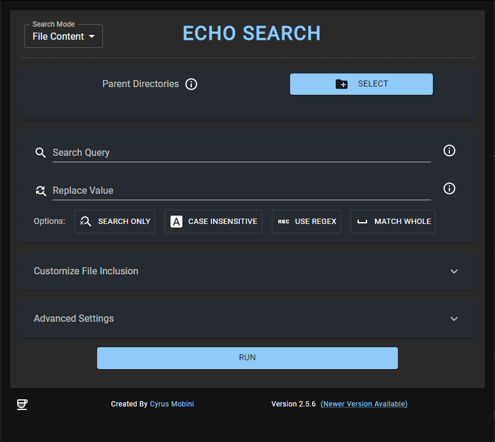
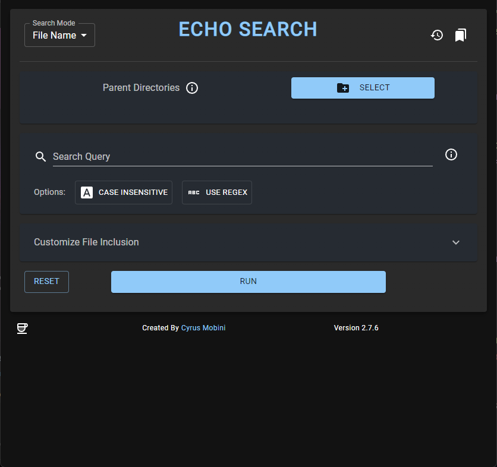
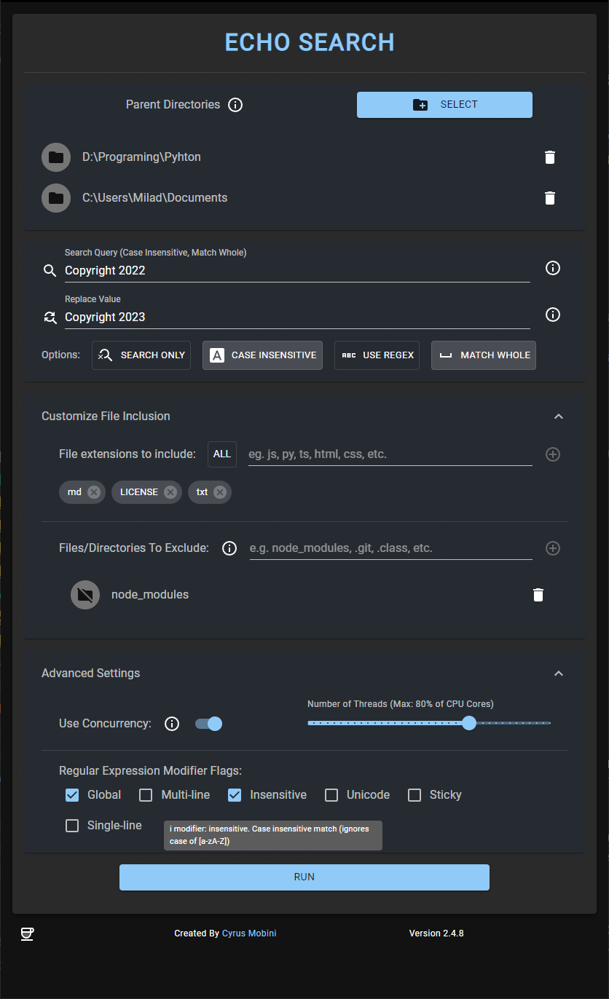
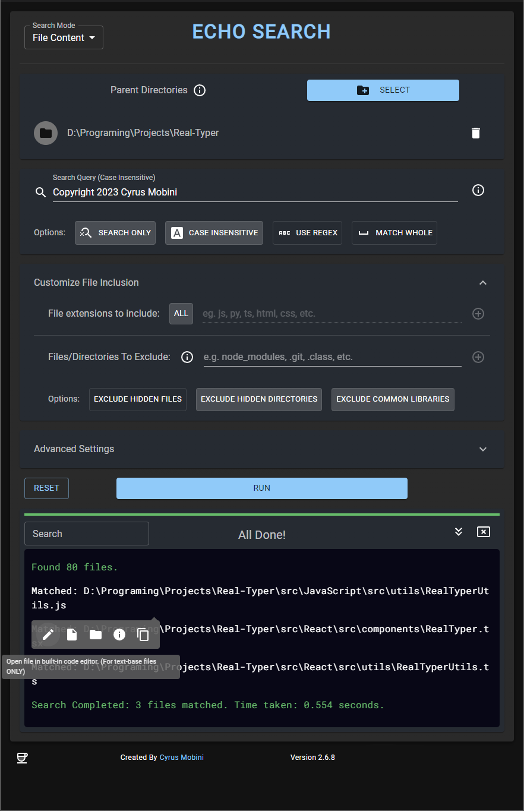
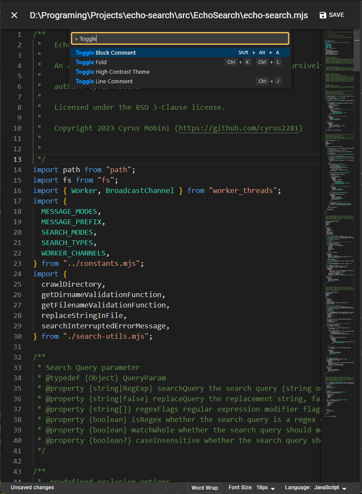
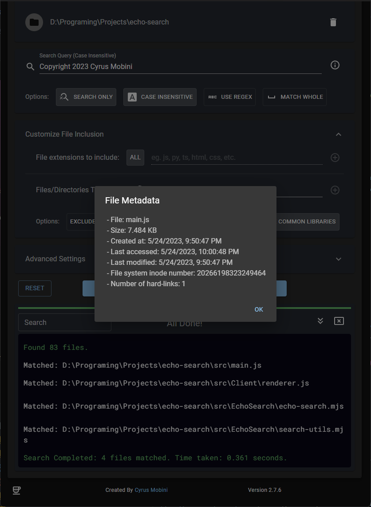

# Echo-Search

[](https://github.com/cyrus2281/Echo-Search/releases)
[](https://github.com/cyrus2281/Echo-Search)
[](https://github.com/cyrus2281/Echo-Search/blob/main/LICENSE)
[](https://www.buymeacoffee.com/cyrus2281)
[](https://github.com/cyrus2281/Echo-Search/releases)


[](https://github.com/cyrus2281/Echo-Search/issues)
[](https://github.com/cyrus2281/Echo-Search/issues?q=is%3Aissue+is%3Aclosed)
[](https://github.com/cyrus2281/Echo-Search/pulls)
[](https://github.com/cyrus2281/Echo-Search/pulls?q=is%3Apr+is%3Aclosed)
[](https://github.com/cyrus2281/Echo-Search/stargazers)


https://github.com/cyrus2281/Echo-Search/assets/68962752/948a8358-3438-4bf1-bdcc-d587f58ea2a5.png


[](https://reactjs.org/)
[](https://www.electronjs.org/)
[](https://mui.com/material-ui/getting-started/overview/)
[](https://www.npmjs.com/package/@monaco-editor/react/)

<br>

Echo Search is a feature-rich and powerful application that allows you to search for a specific text or regular expression query in the content of files or for the file names within a directory and its subdirectories. it also offers the ability to replace the found text with another string of your choice or even open the file in the built-in code editor, so you can perform quick tweaks and updates. With its wide range of options and capabilities, it is an ideal solution for software developers, data analysts, and anyone looking for an efficient way to search and replace text in files. It is also a great tool for searching for files with specific names within a directory and its subdirectories.

## Key Features

- Search for text or regular expressions: Echo Search supports both simple text queries and complex regular expression queries.

- Search for file name: You can search for file name that match a specific query within directories.

- Multi-line queries: You can search for text across multiple lines in a single file.

- Search only mode: If you just want to search for files that contain a specific query, Echo Search has a search only mode that allows you to do just that, without making any replacements.

- Profiles: Echo Search allows you to save your search settings as profiles, so you can easily re-use them later.

- Search History: Echo Search keeps a history of your searches, so you can re-run them later.

- Case sensitivity: You can choose whether the search should be case sensitive or not.

- Whole word match or partial match: You can choose to search for the entire word only, or allow for partial matches.

- Multiple parent directories: You can select multiple parent directories to search in, making it easy to search across a wide range of files.

- File extension options: You can choose to search in all file types, or select specific file extensions to focus on. You can also exclude specific file extensions if desired.

- Pre-defined exclusion options: You can choose to exclude hidden files or directories, or common library directories such as node_modules, libs, etc.

- Concurrent processing: Echo Search supports concurrent processing, allowing you to run the application in multiple threads for faster results. You can select up to 80% of the available cores.

- Regular expression flags: Echo Search supports a range of regular expression flags, allowing you to customize the search even further.

- Live feedback console: Echo Search provides a console with live feedback on the progress of the search, making it easy to monitor its progress. You can also clear or the filter the console at any time.

- Direct file and directory access: You can open the updated files or their directories with the file pre-selected directly from the console or quickly check the file metadata or copy its path.

- Built-in code editor: Echo Search comes with a built-in code editor that allows you to open the files directly from the console and make quick edits and updates.

- Intuitive UI: Echo Search has a clean and intuitive UI that makes it easy to use.


***Note:** The search content mode is only for text based files and can NOT be used with files such as pdf, doc, excel, etc.*


<hr>

## Installation

### Windows

1. Open the `latest` release from [Releases](https://github.com/cyrus2281/Echo-Search/releases).
2. From `Assets` download the `exe` version.
   `Echo Search-X.X.X.WIN.Setup.exe`
3. Install the app by running (double clicking) the file.

### MacOS

1. Open the `latest` release from [Releases](https://github.com/cyrus2281/Echo-Search/releases).
2. From `Assets` download the `zip` version.
   `Echo Search-darwin-x64-X.X.X.zip`
3. After downloading the zip, double click on it to extract the file.
4. Right click on the file and select open. You might see a warning that the developer is unknown, accept and open the app (this is because the app is not registered under the apple's paid subscription)(You might have to repeat this twice).
5. Drag and move the app to the application folder.

### Linux

1. Open the `latest` release from [Releases](https://github.com/cyrus2281/Echo-Search/releases).
2. From `Assets` download the `source code`
3. unzip the code
4. Install the required bundling tools. (Following command is for debian based)
```
sudo apt update && sudo apt install rpm dpkg fakeroot
```
5. from within the repository run: `npm i && npm run make:linux`
6. the app will be built in the `out` directory (exact path will be visible in the terminal)

That's it. Enjoy the app.

<hr>

Echo Search is a versatile and efficient tool for searching and replacing text in files or searching filename within directories. With its extensive range of options, capabilities and the built-in code editor, it is suitable for a wide range of use cases, whether you are a software developer looking for a quick way to update code, or a data analyst searching for specific information in large datasets, or just trying to find a file. Try Echo Search today and see how it can make your life easier.

## Request a feature
You can request a feature by opening an issue in the repository. Please make sure to describe the feature in detail and provide a use case for it.

## Report a bug
You can report a bug by opening an issue in the repository. Please make sure to describe the bug in detail and provide steps to reproduce it including the version of the app and the operating system you are using.

## Application Screenshots

<div style="display:flex; gap:2%;">
  
  
</div>
<br>
<div style="display:flex; gap:2%;">
  
  
</div>
<br>
<div style="display:flex; gap:2%;">
  
  
</div>
<br>


## License

The app is written using Electron (NodeJS) and React.

Echo Search is licensed under the [BSD 3-Clause](./LICENSE).

## Java

This app was originally written in Java. the source code for the legacy version is still available in the `Java` directory.

NOTICE: this version is no longer supported the the latest release is the recommend version to use.

<br>

<hr>

Copyright(c) Cyrus Mobini 2023
