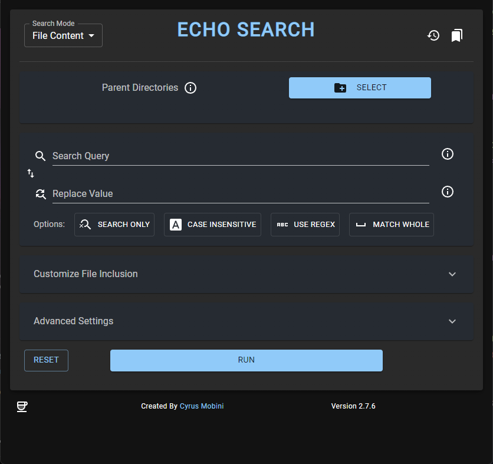

# Eco-Search

This application will crawl recursively through the given parent directory and will look for the given string/regular expression in all text files and replace it with the given string.

You can select multiple parents, mark search as case insensitive or matching whole words, include specific files types, exclude paths or file types, and even configure the regex search modifier flags.

you get live report on the search happening in the provided console in the app.

the app is written with Electron (Node) for the backend, and React (JavaScript) for the frontend.

 

# Installation

### Windows

1. Download the windows installer from [Release Folder]("./release/windows/echo-search-2.1.0%20Setup.exe")
2. Install the app by running the file.
3. a shortcut should appear on your desktop.

That's it. Enjoy the app.

## Echo Search Empty

## Echo Search Filled

## Echo Search Sample output

Copyright(c) Cyrus Mobini. 2023
