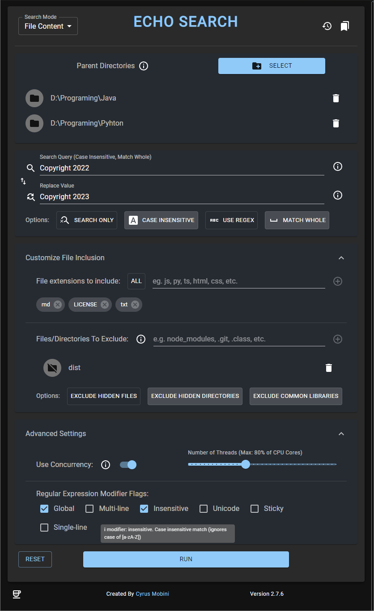

# Eco-Search

 

This application will crawl recursively through the given parent directory and will look for the given string/regular expression in all text files and replace it with the given string.

You can select multiple parent directories, mark search as case insensitive or matching whole words, provide a multi-line search query, include specific files types, exclude paths or file types, and even configure the regex search modifier flags. You can use concurrency to run the application on multiple threads.

You get a live report on the search happening in the provided console in the app and you can open each file with desktop's default app or in the respective folder.

This app is only for text based files and can NOT be used with files such as pdf, doc, excel, etc.

The app is written with Electron (Node) for the backend, and React (JavaScript) for the frontend.

 

# Installation

1. Download the `latest` release for your operating system from [Releases](https://github.com/cyrus2281/Echo-Search/releases).

   - Open the latest release
   - From `Assets` download the version for your operating system
     - Windows: echo-search-X.X.X.WIN.Setup.exe
     - MacOS: echo-search-darwin-x64-X.X.X.zip
     - Linux: clone the code and run `npm i && npm run make:linux`

2. Install the app by running the file.
3. a shortcut should appear on your desktop/app bar.

That's it. Enjoy the app.

# Demo of Application

### Echo Search Empty

### Echo Search Filled

### Echo Search Sample output

## Java

This app was originally written in Java. the source code for the legacy version is still available in the `Java` directory.

NOTICE: this version is no longer supported the the latest release is the recommend version to use.

Copyright(c) Cyrus Mobini 2023
